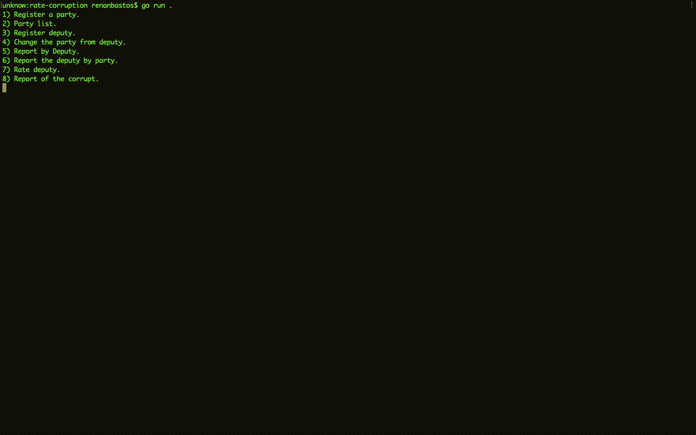

## rate-corruption
This idea is rating corruption among politicians but this is a POC based on Brazilian. Well, I  made only the party and deputy.

### Motivation
The motivation was to create a system to rate corruption of politicians and improved my tech skills using Golang

### Getting starter
```bash
$ git clone https://github.com/renanbastos93/rate-corruption.git
$ cd rate-corruption
$ go run . 
```

### Example of operation

